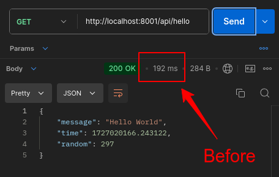
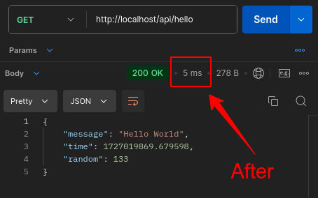

## Laravel Octane

Laravel Octane supercharges your application's performance by serving your application using high-powered application servers, such as Swoole, RoadRunner, and FrankenPHP. Octane boots your application once, keeps it in memory, and then feeds it requests at supersonic speeds. For more information, visit [Laravel Octane Documentation](https://laravel.com/docs/11.x/octane).

### Benefits of Laravel Octane

1. **Performance Boost**: By keeping your application in memory and serving requests using high-performance servers, Octane significantly reduces the response time and increases the throughput of your application.
2. **Reduced Latency**: Octane reduces the latency of your application by eliminating the need to boot the framework from scratch for every request.
3. **Efficient Resource Utilization**: With Octane, you can handle more requests with fewer resources, making your application more efficient and cost-effective.
4. **Scalability**: Octane makes it easier to scale your application horizontally by distributing the load across multiple workers.
5. **Improved Developer Experience**: Octane provides a seamless development experience with features like hot reloading, which automatically reloads your application when you make changes to the code.

### Before and After

#### Before Octane


#### After Octane


### How to Install and Run Laravel Octane

1. **Install Dependencies**:
   1. Run `composer install` to install the dependencies.
   2. Run `npm install` to install the dependencies.
2. **Start the Development Server**:
   1. Run `php artisan octane:start` to start the Octane server.
   2. Run `npm run dev` to start the Vite server.
3. **Access the Application**:
   1. Open your web browser and navigate to `http://localhost:8000`.


### Using Laravel Sail with Octane

Laravel Sail is a lightweight command-line interface for interacting with Laravel's default Docker development environment. You can use Sail to run Laravel Octane in a Docker container.

#### Steps to Use Laravel Sail with Octane

1. **Install Laravel Sail**:
   1. Run `composer require laravel/sail --dev` to add Sail as a development dependency.
   2. Run `php artisan sail:install` to install Sail.

2. **Start the Sail Environment**:
   1. Run `./vendor/bin/sail up` to start the Docker containers.

3. **Install Octane**:
   1. Run `./vendor/bin/sail composer require laravel/octane` to add Octane to your project.
   2. Run `./vendor/bin/sail artisan octane:install` to install Octane.

4. **Start the Octane Server**:
   1. Run `./vendor/bin/sail artisan octane:start` to start the Octane server within the Sail environment.

5. **Access the Application**:
   1. Open your web browser and navigate to `http://localhost` to access your application running with Octane in the Sail environment.

By using Laravel Sail, you can easily set up and run Laravel Octane in a Dockerized environment, ensuring a consistent development setup across different machines.


### Configuration

To configure the Octane server, you can use the `octane:start` command with the `--server` option. For example, to start the Octane server with the FrankenPHP server, run:

```bash
php artisan octane:start --server=FrankenPHP
```

🎀 You Can use docker directly, run
```bash
docker compose up -d
```

### Additional Resources

For more information on configuring and using Laravel Octane, visit the [Laravel Octane Documentation](https://laravel.com/docs/11.x/octane).
